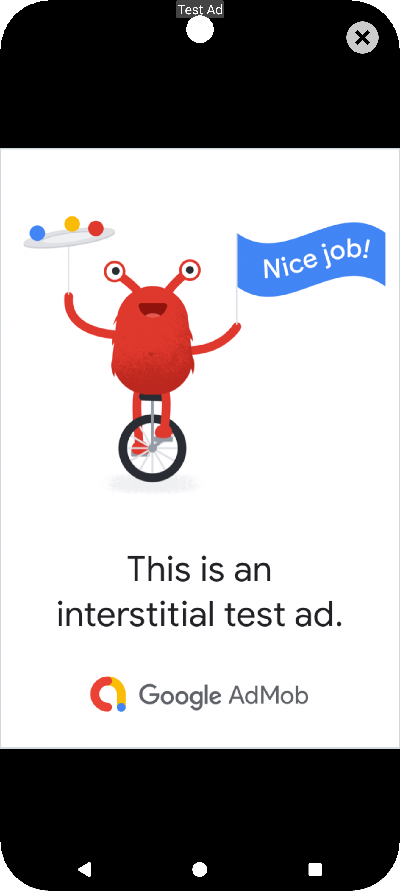

# AdManageKit
[](https://jitpack.io/#i2hammad/AdManageKit)


AdManageKit is a comprehensive Android library designed to simplify the integration and management of Google AdMob ads, Google Play Billing, and User Messaging Platform (UMP) consent.

**Latest Version `3.4.0`** fixes a ~50% app open splash ad show-rate miss, the native large ad tablet layout, and stabilizes the multi-provider waterfall with Yandex Ads integration.

---

## Next-Gen GMA SDK Version

> **Beta Notice:** The Next-Gen GMA SDK (`com.google.android.libraries.ads.mobile.sdk`) is currently in **beta by Google**, and AdManageKit's nextgen branch is also in **beta**. The underlying Google SDK may receive breaking changes until it reaches stable release. For production use, the **main branch** is the stable option.

AdManageKit offers a **Next-Gen GMA SDK** version on the `nextgen` branch, featuring Google's modern preloader-based ad loading system.

### Why Next-Gen?

| Feature | Main Branch (GMS SDK) | Next-Gen Branch |
|---------|----------------------|-----------------|
| SDK | `play-services-ads` (stable) | `ads-mobile-sdk` (beta) |
| Ad Loading | Traditional load/show | Preloader-based with auto-refill |
| Threading | Manual main thread dispatch | Automatic background thread safety |
| Buffer System | N/A | Configurable ad buffers per type |
| Background Handling | Basic | Smart pending ad queue |

### Next-Gen Features

- **Preloader System**: SDK automatically loads next ad after one is consumed
- **Background-Aware Ads**: App open ads won't show when app is in background
- **Pending Ad Queue**: Ads that load while backgrounded are saved for return
- **Configurable Buffers**: Set how many ads to keep ready per type

```kotlin
// Next-Gen preloader configuration
AdManageKitConfig.apply {
    enableInterstitialPreloader = true
    enableAppOpenPreloader = true
    interstitialPreloaderBufferSize = 2
}
```

### Migration Compatibility

Both branches use the same callback signatures via type aliases:
- `AdKitError` → resolves to appropriate SDK error type
- `AdKitLoadError` → resolves to appropriate SDK load error type
- `AdKitValue` → resolves to appropriate SDK value type

Your callback implementations work on both branches without changes.

### Which Version Should I Use?

| Use Case | Recommended |
|----------|-------------|
| Production apps (stable) | **Main branch** (v3.4.0) |
| New projects wanting latest features | **Nextgen branch** (v4.1.1) |
| Testing preloader system | **Nextgen branch** |
| Risk-averse production | **Main branch** |

---

## What's New in 3.4.0

### App Open Splash Ad Show Rate Fix
- **Fixed ~50% show-rate miss**: `forceShowAdIfAvailable()` now takes over an in-progress dialog fetch (started by `onStart()`'s `showAdIfAvailable()`) instead of triggering the dialog guard and firing `onNextAction()` prematurely
- **`showAdIfAvailable()` guarded**: Lifecycle-driven auto-show now skips if a `forceShowAdIfAvailable()` fetch is already in progress (`isFetchingWithDialog` check)
- No API changes required

### Native Large Ad Tablet Layout Fix
- **Fixed**: `layout_native_large.xml` (sw600dp) container changed from `LinearLayout` to `FrameLayout`, preventing layout rendering issues on tablet screens (600dp+)
- **Stable release**: Consolidates all improvements from 3.3.8 and 3.3.9 including multi-provider waterfall, Yandex Ads, and app open ad callback improvements

---

## What's New in 3.3.9

### App Open Ad Callback Improvements
- **New `onAdTimedOut()` callback**: Dedicated event when ad load exceeds timeout (separate from `onFailedToLoad`)
- **`onFailedToLoad()` now fires**: Previously never called for app open ads with dialog; now fires correctly for both AdMob and waterfall paths
- **Dialog-first guarantee**: Welcome dialog is always dismissed before any callback fires

```kotlin
appOpenManager.forceShowAdIfAvailable(activity, object : AdManagerCallback() {
    override fun onAdTimedOut() { /* timeout-specific handling */ }
    override fun onFailedToLoad(error: AdKitError?) { /* load failure handling */ }
    override fun onNextAction() { navigateNext() }
})
```

### Adaptive Full-Width Banner in Waterfall
- **Fixed**: Banner ads via waterfall now use adaptive full-width sizing (was fixed 320x50dp)
- **Collapsible support**: Collapsible banner settings now pass through waterfall to AdMob providers

## What's New in 3.3.8

### Multi-Provider Waterfall & Yandex Ads
- **Multi-Ad-Provider Architecture**: New core interfaces (`InterstitialAdProvider`, `AppOpenAdProvider`, `BannerAdProvider`, `NativeAdProvider`, `RewardedAdProvider`) in `admanagekit-core` with zero external dependencies
- **Waterfall Mediation**: Automatic fallback across ad networks for all ad types (interstitial, app open, banner, native, rewarded)
- **Yandex Ads Module**: New `admanagekit-yandex` module with full Yandex Mobile Ads SDK integration
- **Transparent Integration**: Configure provider chains once; all existing API calls use waterfall automatically
- **Backward Compatible**: No changes required to existing AdMob-only code

```kotlin
// Register providers and configure waterfall chains
AdProviderConfig.registerProvider(AdProvider.ADMOB, AdMobProviderRegistration())
AdProviderConfig.registerProvider(AdProvider.YANDEX, YandexProviderRegistration())
AdProviderConfig.setInterstitialChain(listOf(AdProvider.ADMOB, AdProvider.YANDEX))
```

See [Multi-Provider Waterfall](docs/MULTI_PROVIDER_WATERFALL.md) and [Yandex Integration](docs/YANDEX_INTEGRATION.md) for the full guide.

## What's New in 3.3.7

### Welcome Dialog for Cached App Open Ads
Cached app open ads now display the welcome back dialog before showing, providing a consistent transition across all display paths (ON_DEMAND, ONLY_CACHE, HYBRID).

### Background Ad Prefetching
`appOpenFetchFreshAd` repurposed to control when app open ads are fetched:
- `false` (default): Prefetch on background (onStop) — ad ready instantly on return
- `true`: Fetch fresh on foreground (onStart) — may show loading dialog

```kotlin
AdManageKitConfig.appOpenFetchFreshAd = false // Prefetch in background (default)
```

### Default Changes
- **Native ad caching disabled by default**: `NativeAdManager.enableCachingNativeAds` now defaults to `false`
- **Auto-retry disabled by default**: `AdManageKitConfig.autoRetryFailedAds` now defaults to `false`

## What's New in 3.3.5

### App Open Loading Strategies
- **Proper Loading Strategy Support**: AppOpenManager now fully supports `AdLoadingStrategy` (ON_DEMAND, ONLY_CACHE, HYBRID)
- **Ad Freshness Tracking**: Cached ads track load time to prevent showing stale ads
- **Smart Cache Usage**: ON_DEMAND strategy uses cached ads if still fresh (within `appOpenAdFreshnessThreshold`)
- **Auto-Reload Config**: New `appOpenAutoReload` setting to control automatic reloading after ad dismissal

```kotlin
AdManageKitConfig.apply {
    // Loading strategy (ON_DEMAND, ONLY_CACHE, HYBRID)
    appOpenLoadingStrategy = AdLoadingStrategy.HYBRID

    // Freshness threshold for cached ads (default: 4 hours)
    appOpenAdFreshnessThreshold = 4.hours

    // Auto-reload after ad dismissal (default: true)
    appOpenAutoReload = true
}
```

## What's New in 3.3.4

### Subscription Expiry Verification
- **Server-Side Verification**: New API to verify subscriptions and get accurate expiry dates from your backend
- **Expiry Methods**: `getExpiryTimeFormatted()`, `getRemainingDays()`, `isExpired()` on PurchaseResult
- **AppPurchase Helpers**: `getSubscriptionExpiryTime()`, `getSubscriptionRemainingDays()`, `isSubscriptionExpired()`

```kotlin
// Set up verification callback
AppPurchase.getInstance().setSubscriptionVerificationCallback { packageName, subscriptionId, purchaseToken, listener ->
    yourApi.verifySubscription(purchaseToken) { expiryMillis ->
        val details = SubscriptionVerificationCallback.SubscriptionDetails.Builder()
            .setExpiryTimeMillis(expiryMillis)
            .build()
        listener.onVerified(details)
    }
}

// Verify and get expiry
AppPurchase.getInstance().verifySubscription("premium_monthly",
    object : AppPurchase.SubscriptionVerificationListener {
        override fun onVerified(subscription: PurchaseResult) {
            val expiryDate = subscription.getExpiryTimeFormatted("dd MMM yyyy")
            val daysLeft = subscription.getRemainingDays()
        }
        override fun onVerificationFailed(error: String?) { }
    }
)
```

## What's New in 3.3.3

### SDK-Agnostic Type Aliases
- **Migration Compatibility**: Callbacks use `AdKitError`, `AdKitLoadError`, `AdKitValue` type aliases
- **Same Signatures**: Your callback implementations work across both SDK versions
- **Easy Migration**: Switch between main (GMS SDK) and nextgen (Next-Gen SDK) branches without code changes

```kotlin
// Callbacks now use type aliases that resolve to the appropriate SDK types
object : AdLoadCallback() {
    override fun onFailedToLoad(error: AdKitError?) {  // Works on both branches
        Log.e("Ads", "Failed: ${error?.message}")
    }
    override fun onPaidEvent(adValue: AdKitValue) {    // Works on both branches
        trackRevenue(adValue.valueMicros)
    }
}
```

## What's New in 3.3.2

### InterstitialAdBuilder Fixes
- **Ad Unit Assignment**: Fixed ad unit not being assigned to AdManager on first HYBRID fetch
- **Immediate Availability**: `adUnit()` now sets AdManager.adUnitId immediately for first-call reliability

### everyNthTime Feature Fix
- **Counter Persistence**: Call counter now persists across builder instances in AdManager
- **Counter API**: New methods to manage counters: `getCallCount()`, `resetCallCount()`, `resetAllCallCounts()`

```kotlin
// everyNthTime now works correctly
InterstitialAdBuilder.with(activity)
    .adUnit(adUnitId)
    .everyNthTime(3)  // Shows on 3rd, 6th, 9th calls, etc.
    .show { navigateNext() }

// Reset counters when user upgrades
AdManager.getInstance().resetAllCallCounts()
```

### New Native Templates
- **flexible**: Adaptive layout that adjusts to available space
- **icon_left**: Icon on left side with MediaView at top for GridView display
- **top_icon_media**: Icon at top, MediaView in middle, CTA at bottom

```kotlin
nativeTemplateView.setTemplate(NativeAdTemplate.FLEXIBLE)
nativeTemplateView.setTemplate(NativeAdTemplate.ICON_LEFT)
nativeTemplateView.setTemplate(NativeAdTemplate.TOP_ICON_MEDIA)
```

## What's New in 3.1.0

### FRESH_WITH_CACHE_FALLBACK Strategy Fix
- **Auto-Caching**: Successfully loaded ads are now properly cached for future fallback
- **RecyclerView Optimized**: Fresh ads build up the cache over time for better fallback availability
- **Complete Implementation**: Strategy now works as documented

### New Native Template
- **MEDIUM_HORIZONTAL**: 55% media (left) / 45% content (right) horizontal split layout
- **27 Total Templates**: 21 standard + 6 video templates

## What's New in 3.0.0

### Ad Pool System
- **Multiple Ad Units**: Load multiple interstitial ad units into a pool for maximum show rate
- **Auto-Selection**: Shows ANY available ad from the pool when requested
- **Duplicate Prevention**: Automatically skips duplicate load requests

### Smart Splash Ads
- **showOrWaitForAd()**: Single method handles all splash scenarios automatically
- **Intelligent Behavior**: Shows cached ad immediately, waits if loading, or fetches fresh

### App Open Ad Prefetching
- **prefetchNextAd()**: Prefetch ads before external intents for instant display on return
- **isAdLoading()**: Check if ad is currently being fetched

### Enhanced Analytics
- **Session Tracking**: Fill rate, show rate, and impression tracking
- **getAdStats()**: Access session-level ad performance metrics

### Technical Improvements
- Modern `WindowInsetsController` API (replaces deprecated systemUiVisibility)
- Thread-safe ad pool with `ConcurrentHashMap`
- Cross-ad-unit fallback for native ads

## Screenshots

| NativeBannerSmall Ad | Interstitial Ad | App Open Ad | UMP Consent Form |
|----------------------|-----------------|-----------------|------------------|
|  |  |  |  |

## Demo Video

Watch a short demo of `AdManageKit` in action:

[Watch on YouTube](https://youtube.com/shorts/h_872tOARpU)

## Getting Started

### Installation

**Step 1:** Add JitPack to your root `build.gradle`:

```groovy
dependencyResolutionManagement {
    repositoriesMode.set(RepositoriesMode.FAIL_ON_PROJECT_REPOS)
    repositories {
        mavenCentral()
        maven { url 'https://jitpack.io' }
    }
}
```

**Step 2:** Add dependencies to your app's `build.gradle`:

<table>
<tr>
<th>Main Branch (Stable GMS SDK)</th>
<th>Next-Gen Branch (Beta GMA SDK)</th>
</tr>
<tr>
<td>

```groovy
implementation 'com.github.i2hammad.AdManageKit:ad-manage-kit:v3.4.0'
implementation 'com.github.i2hammad.AdManageKit:ad-manage-kit-billing:v3.4.0'
implementation 'com.github.i2hammad.AdManageKit:ad-manage-kit-core:v3.4.0'

// For Jetpack Compose support
implementation 'com.github.i2hammad.AdManageKit:ad-manage-kit-compose:v3.4.0'

// For Yandex Ads multi-provider support
implementation 'com.github.i2hammad.AdManageKit:ad-manage-kit-yandex:v3.4.0'
```

</td>
<td>

```groovy
implementation 'com.github.i2hammad.AdManageKit:ad-manage-kit-nextgen:v4.1.1'
implementation 'com.github.i2hammad.AdManageKit:ad-manage-kit-billing-nextgen:v4.1.1'
implementation 'com.github.i2hammad.AdManageKit:ad-manage-kit-core-nextgen:v4.1.1'

// For Jetpack Compose support
implementation 'com.github.i2hammad.AdManageKit:ad-manage-kit-compose-nextgen:v4.1.1'
```

</td>
</tr>
</table>

**Step 3:** Sync your project with Gradle.

## Features

### NativeTemplateView (v2.6.0+)
- **27 Template Styles**: card_modern, material3, app_store, social_feed, gradient_card, pill_banner, medium_horizontal, flexible, icon_left, top_icon_media, spotlight, and more
- **XML & Programmatic**: Set templates via `app:adTemplate` or `setTemplate()`
- **Material 3 Theming**: Automatic dark/light mode support
- **AdChoices Control**: Configure placement position (v2.9.0+)
- **Video-Ready**: All templates support video ads (120dp+ MediaView)
- [View Documentation](docs/NATIVE_TEMPLATE_VIEW.md)

### Ad Loading Strategies (v2.6.0+)
- **ON_DEMAND**: Fetch fresh ads with loading dialog
- **ONLY_CACHE**: Instant display from cache
- **HYBRID**: Cache-first with fallback fetch (recommended)
- [View Documentation](docs/AD_LOADING_STRATEGIES.md)

### Jetpack Compose Integration
- BannerAdCompose, NativeAdCompose, InterstitialAdCompose
- Programmatic native ads without predefined layouts
- ConditionalAd, CacheWarmingEffect utilities

### AdMob Ads Management
- **Banner Ads**: Auto-refresh, collapsible banners, smart retry
- **Native Ads**: Small, Medium, Large formats with caching
- **Interstitial Ads**: Time/count-based triggers, dialog support
- **App Open Ads**: Lifecycle-aware with activity exclusion

### Centralized Configuration
- **AdManageKitConfig**: Single configuration point
- Environment-specific settings (debug vs production)
- Runtime configuration changes

### Intelligent Native Ad Caching
- Screen-aware caching prevents collisions
- Smart preloading with usage patterns
- LRU cache with configurable expiration

### Reliability & Performance
- Smart retry with exponential backoff
- Circuit breaker for failing ad units
- Memory leak prevention with WeakReference

### Privacy & Compliance
- UMP consent management (GDPR/CCPA)
- Automatic ad hiding for purchased users

### Multi-Provider Waterfall (New)
- **Multiple Ad Networks**: Load ads from AdMob, Yandex, and more with automatic fallback
- **Zero Code Changes**: Configure provider chains once; all existing API calls use waterfall automatically
- **Per-Ad-Type Chains**: Configure different provider orders for each ad format
- **Region-Based**: Prioritize providers by user locale (e.g., Yandex first for Russia)
- [View Waterfall Documentation](docs/MULTI_PROVIDER_WATERFALL.md)
- [Yandex Integration Guide](docs/YANDEX_INTEGRATION.md)

### Multi-Module Architecture
- **Core Module**: Shared interfaces and configuration
- **Compose Module**: Jetpack Compose integration
- **Billing Module**: Google Play Billing Library v8
- **Yandex Module**: Yandex Ads SDK provider

---

## Usage Guide

### Quick Configuration

Configure AdManageKit in your Application class:

```kotlin
class MyApp : Application() {
    private lateinit var appOpenManager: AppOpenManager

    override fun onCreate() {
        super.onCreate()

        // Configure AdManageKit
        AdManageKitConfig.apply {
            debugMode = BuildConfig.DEBUG
            enableSmartPreloading = true
            autoRetryFailedAds = true

            // Ad Loading Strategies (v2.6.0+)
            interstitialLoadingStrategy = AdLoadingStrategy.HYBRID
            appOpenLoadingStrategy = AdLoadingStrategy.HYBRID
            nativeLoadingStrategy = AdLoadingStrategy.HYBRID

            // Auto-reload ads after showing (v2.7.0+)
            interstitialAutoReload = true  // default: true
            appOpenAutoReload = true       // default: true
            rewardedAutoReload = true      // default: true
        }

        // Set up billing
        BillingConfig.setPurchaseProvider(BillingPurchaseProvider())

        // Initialize app open ads
        appOpenManager = AppOpenManager(this, "your-app-open-ad-unit-id")
    }
}
```

### Multi-Provider Waterfall (Optional)

Add Yandex (or other providers) as fallback ad networks with zero changes to your existing ad loading code:

```groovy
// Add Yandex module
implementation 'com.github.i2hammad.AdManageKit:ad-manage-kit-yandex:v3.4.0'
```

```kotlin
// In Application.onCreate(), after AdManageKitConfig setup:
YandexProviderRegistration.initialize(this)
val admob = AdMobProviderRegistration.create()
val yandex = YandexProviderRegistration.create()

// Map your AdMob ad unit IDs to Yandex equivalents
AdUnitMapping.register("ca-app-pub-xxx/your-interstitial", mapOf("yandex" to "R-M-XXXXXX-Y"))
AdUnitMapping.register("ca-app-pub-xxx/your-native", mapOf("yandex" to "R-M-XXXXXX-Y"))

// Set provider chains (order = priority)
AdProviderConfig.setInterstitialChain(listOf(admob.interstitialProvider, yandex.interstitialProvider))
AdProviderConfig.setNativeChain(listOf(admob.nativeProvider, yandex.nativeProvider))
// ... same for banner, app open, rewarded
```

See [Multi-Provider Waterfall](docs/MULTI_PROVIDER_WATERFALL.md) and [Yandex Integration](docs/YANDEX_INTEGRATION.md) for the full guide.

### NativeTemplateView (v2.6.0+)

#### XML Usage

```xml
<com.i2hammad.admanagekit.admob.NativeTemplateView
    android:id="@+id/nativeTemplateView"
    android:layout_width="match_parent"
    android:layout_height="wrap_content"
    app:adTemplate="material3" />
```

#### Available Templates

| Template | Best For |
|----------|----------|
| `card_modern` | General use |
| `material3` | M3 apps |
| `minimal` | Content-focused |
| `compact_horizontal` | Lists |
| `list_item` | RecyclerView items |
| `magazine` | News/blog apps |
| `app_store` | App promotion (v2.9.0+) |
| `social_feed` | Feed integration (v2.9.0+) |
| `gradient_card` | Premium feel (v2.9.0+) |
| `pill_banner` | Inline placement (v2.9.0+) |
| `medium_horizontal` | 55/45 media-content split (v3.0.0+) |
| `spotlight` | High visibility (v2.9.0+) |
| `media_content_split` | Balanced display (v2.9.0+) |
| `flexible` | Adaptive layout (v3.3.2+) |
| `icon_left` | Icon on left, GridView optimized (v3.3.2+) |
| `top_icon_media` | Icon at top, MediaView center (v3.3.2+) |
| `video_small/medium/large` | Video content |
| `video_square/vertical/fullscreen` | Social feeds |

#### Programmatic Usage

```kotlin
// Load with default template
nativeTemplateView.loadNativeAd(activity, "ca-app-pub-xxx/yyy")

// Change template
nativeTemplateView.setTemplate(NativeAdTemplate.MAGAZINE)
nativeTemplateView.loadNativeAd(activity, "ca-app-pub-xxx/yyy")

// With callback
nativeTemplateView.loadNativeAd(activity, adUnitId, object : AdLoadCallback() {
    override fun onAdLoaded() { /* success */ }
    override fun onFailedToLoad(error: AdError?) { /* error */ }
})

// With strategy override
nativeTemplateView.loadNativeAd(activity, adUnitId, callback, AdLoadingStrategy.ONLY_CACHE)
```

### Banner Ads

```xml
<com.i2hammad.admanagekit.admob.BannerAdView
    android:id="@+id/bannerAdView"
    android:layout_width="match_parent"
    android:layout_height="wrap_content" />
```

```kotlin
bannerAdView.loadBanner(this, "ca-app-pub-xxx/yyy")
// Collapsible banner
bannerAdView.loadCollapsibleBanner(this, "ca-app-pub-xxx/yyy", true)
```

### Native Ads (Traditional Views)

```xml
<com.i2hammad.admanagekit.admob.NativeBannerSmall
    android:id="@+id/nativeBannerSmall"
    android:layout_width="match_parent"
    android:layout_height="wrap_content" />
```

```kotlin
nativeBannerSmall.loadNativeBannerAd(this, "ca-app-pub-xxx/yyy")
// With caching
nativeBannerSmall.loadNativeBannerAd(activity, adUnitId, useCachedAd = true)
```

### Interstitial Ads

```kotlin
// Load
AdManager.getInstance().loadInterstitialAd(this, "ca-app-pub-xxx/yyy")

// Show immediately
AdManager.getInstance().forceShowInterstitial(this, object : AdManagerCallback() {
    override fun onNextAction() { navigateNext() }
})

// Show with dialog
AdManager.getInstance().forceShowInterstitialWithDialog(this, callback)

// Time-based (every 15 seconds)
AdManager.getInstance().showInterstitialAdByTime(this, callback)

// Count-based
AdManager.getInstance().showInterstitialAdByCount(this, callback, maxDisplayCount = 3)
```

#### Auto-Reload Configuration (v2.7.0+)

Control whether interstitial ads automatically reload after being shown:

```kotlin
// Global config (applies to all AdManager methods)
AdManageKitConfig.interstitialAutoReload = false  // Disable auto-reload

// Per-call override via InterstitialAdBuilder
InterstitialAdBuilder.with(activity)
    .adUnit(adUnitId)
    .autoReload(true)  // Override global setting for this call
    .show { navigateNext() }

// Per-call override via AdManager
AdManager.getInstance().showInterstitialIfReady(activity, callback, reloadAd = false)
```

**Priority:** `InterstitialAdBuilder.autoReload()` > `AdManageKitConfig.interstitialAutoReload`

### Rewarded Ads

```kotlin
// Initialize once (e.g., in Application.onCreate())
RewardedAdManager.initialize(context, "ca-app-pub-xxx/yyy")

// Show when ready
if (RewardedAdManager.isAdLoaded()) {
    RewardedAdManager.showAd(activity, object : RewardedAdManager.RewardedAdCallback {
        override fun onRewardEarned(rewardType: String, rewardAmount: Int) {
            grantReward(rewardType, rewardAmount)
        }
        override fun onAdDismissed() {
            continueGameFlow()
        }
    })
}

// Load with timeout (splash screens)
RewardedAdManager.loadRewardedAdWithTimeout(context, 5000, callback)

// Preload during natural pauses
RewardedAdManager.preload(context)

// Control auto-reload
AdManageKitConfig.rewardedAutoReload = false  // Disable globally
RewardedAdManager.showAd(activity, callback, autoReload = false)  // Per-call override
```

### App Open Ads

```kotlin
// In Application class
appOpenManager = AppOpenManager(this, "ca-app-pub-xxx/yyy")

// Exclude activities
appOpenManager.disableAppOpenWithActivity(MainActivity::class.java)

// Force show
appOpenManager.forceShowAdIfAvailable(activity, callback)

// Skip next ad
appOpenManager.skipNextAd()
```

#### Single-Activity App Support (v3.2.0+)

For apps with one activity and multiple fragments:

```kotlin
// Set current screen when navigating
navController.addOnDestinationChangedListener { _, destination, _ ->
    appOpenManager.setCurrentScreenTag(destination.label?.toString())
}

// Exclude specific screens
appOpenManager.excludeScreenTags("Payment", "Onboarding", "Checkout")

// Or use fragment tag provider
appOpenManager.setFragmentTagProvider {
    supportFragmentManager.fragments.lastOrNull()?.tag
}
appOpenManager.excludeFragmentTags("PaymentFragment", "OnboardingFragment")

// Temporarily disable during critical flows
appOpenManager.disableAppOpenAdsTemporarily()
// ... perform operation ...
appOpenManager.enableAppOpenAds()
```

### Jetpack Compose

```kotlin
@Composable
fun MyScreen() {
    // Banner
    BannerAdCompose(adUnitId = "ca-app-pub-xxx/yyy")

    // NativeTemplateView with any template (v2.6.0+)
    NativeTemplateCompose(
        adUnitId = "ca-app-pub-xxx/yyy",
        template = NativeAdTemplate.MATERIAL3,
        loadingStrategy = AdLoadingStrategy.HYBRID
    )

    // Native with loading strategy (ON_DEMAND or HYBRID only)
    NativeBannerMediumCompose(
        adUnitId = "ca-app-pub-xxx/yyy",
        loadingStrategy = AdLoadingStrategy.HYBRID
    )

    // Interstitial
    val showInterstitial = rememberInterstitialAd(
        adUnitId = "ca-app-pub-xxx/yyy",
        preloadAd = true
    )
    Button(onClick = { showInterstitial() }) {
        Text("Show Ad")
    }

    // Conditional (hides for purchased users)
    ConditionalAd {
        ProgrammaticNativeBannerMediumCompose(adUnitId = "ca-app-pub-xxx/yyy")
    }
}
```

### UMP Consent

```kotlin
AdsConsentManager.getInstance(this).requestUMP(
    activity = this,
    isDebug = true,
    testDeviceId = "TEST_DEVICE_ID",
    resetConsent = false,
    listener = object : UMPResultListener {
        override fun onCheckUMPSuccess(isConsentGiven: Boolean) {
            if (isConsentGiven) {
                // Initialize and load ads here
                AdManager.getInstance().loadInterstitialAd(activity, adUnitId)
            }
        }
    }
)
```

### In-App Purchases (v2.9.0+)

```kotlin
// Define products with categories
val products = listOf(
    PurchaseItem("coins_100", TYPE_IAP.PURCHASE, PurchaseCategory.CONSUMABLE),
    PurchaseItem("remove_ads", TYPE_IAP.PURCHASE, PurchaseCategory.REMOVE_ADS),
    PurchaseItem("lifetime", TYPE_IAP.PURCHASE, PurchaseCategory.LIFETIME_PREMIUM),
    PurchaseItem("premium_monthly", "free_trial", TYPE_IAP.SUBSCRIPTION)
)

// Initialize
AppPurchase.getInstance().initBilling(application, products)

// Purchase
AppPurchase.getInstance().purchase(activity, "remove_ads")

// Subscribe
AppPurchase.getInstance().subscribe(activity, "premium_monthly")

// Check status
if (AppPurchase.getInstance().isPurchased()) {
    // User has premium (subscription, lifetime, or remove_ads)
}

// Track purchases and handle consumables
AppPurchase.getInstance().setPurchaseHistoryListener(object : PurchaseHistoryListener {
    override fun onNewPurchase(productId: String, purchase: PurchaseResult) {
        if (productId == "coins_100") {
            addCoins(100 * purchase.quantity)
            AppPurchase.getInstance().consumePurchase(productId) // Manual consume
        }
    }
    override fun onPurchaseConsumed(productId: String, purchase: PurchaseResult) { }
})
```

#### Subscription Management (v2.9.0+)

```kotlin
// Check subscription state
val state = AppPurchase.getInstance().getSubscriptionState("premium_monthly")
when (state) {
    SubscriptionState.ACTIVE -> showPremiumUI()
    SubscriptionState.CANCELLED -> showRenewalPrompt() // Still has access
    SubscriptionState.EXPIRED -> showSubscribeButton()
}

// Upgrade subscription
AppPurchase.getInstance().upgradeSubscription(activity, "premium_yearly")

// Downgrade subscription
AppPurchase.getInstance().downgradeSubscription(activity, "premium_basic")

// Full control with proration mode
AppPurchase.getInstance().changeSubscription(
    activity,
    "premium_monthly",
    "premium_yearly",
    SubscriptionReplacementMode.CHARGE_PRORATED_PRICE
)
```

---

## Documentation

- [NativeTemplateView Guide](docs/NATIVE_TEMPLATE_VIEW.md)
- [Ad Loading Strategies](docs/AD_LOADING_STRATEGIES.md)
- [Jetpack Compose Integration](docs/COMPOSE_INTEGRATION.md)
- [Native Ads Caching](docs/native-ads-caching.md)
- [Interstitial Ads](docs/interstitial-ads.md)
- [Rewarded Ads](docs/rewarded-ads.md)
- [App Open Ads](docs/app-open-ads.md)
- [Multi-Provider Waterfall](docs/MULTI_PROVIDER_WATERFALL.md)
- [Yandex Integration](docs/YANDEX_INTEGRATION.md)
- [Billing Integration Guide](docs/APP_PURCHASE_GUIDE.md)
- [Release Notes v3.4.0](docs/release-notes/RELEASE_NOTES_v3.4.0.md)
- [Release Notes v3.3.9](docs/release-notes/RELEASE_NOTES_v3.3.9.md)
- [Release Notes v3.3.8](docs/release-notes/RELEASE_NOTES_v3.3.8.md)
- [Release Notes v3.3.7](docs/release-notes/RELEASE_NOTES_v3.3.7.md)
- [Release Notes v3.3.6](docs/release-notes/RELEASE_NOTES_v3.3.6.md)
- [Release Notes v3.3.5](docs/release-notes/RELEASE_NOTES_v3.3.5.md)
- [Release Notes v3.3.4](docs/release-notes/RELEASE_NOTES_v3.3.4.md)
- [Release Notes v3.3.3](docs/release-notes/RELEASE_NOTES_v3.3.3.md)
- [Release Notes v3.3.2](docs/release-notes/RELEASE_NOTES_v3.3.2.md)
- [Release Notes v3.3.0](docs/release-notes/RELEASE_NOTES_v3.3.0.md)
- [Release Notes v3.1.0](docs/release-notes/RELEASE_NOTES_v3.1.0.md)
- [Release Notes v3.0.0](docs/release-notes/RELEASE_NOTES_v3.0.0.md)
- [API Reference](docs/API_REFERENCE.md)

### Wiki
- [Multi-Provider Waterfall](wiki/Multi-Provider-Waterfall.md)
- [Yandex Integration](wiki/Yandex-Integration.md)
- [Rewarded Ads](wiki/Rewarded-Ads.md)
- [Billing Integration](wiki/Billing-Integration.md)
- [Purchase Categories](wiki/Purchase-Categories.md)
- [Consumable Products](wiki/Consumable-Products.md)
- [Subscriptions](wiki/Subscriptions.md)
- [Subscription Upgrades](wiki/Subscription-Upgrades.md)

### API Documentation (Dokka)

**Online:** [https://i2hammad.github.io/AdManageKit/](https://i2hammad.github.io/AdManageKit/)

Generate locally:

```bash
./gradlew dokkaGenerateHtml
```

Output: `build/dokka/html/index.html`

### MCP Server (AI Integration)

[](https://www.npmjs.com/package/admanagekit-mcp-server)

AdManageKit provides an [MCP (Model Context Protocol)](https://modelcontextprotocol.io/) server that integrates with AI tools like Claude Code, Claude Desktop, Cursor, and other MCP-compatible clients. It provides **10 tools** for documentation lookup and code generation.

#### Tools

| Category | Tools |
|----------|-------|
| **Documentation** | `search_docs`, `get_doc_by_topic`, `get_api_reference`, `get_release_notes`, `get_migration_guide`, `list_documentation` |
| **Code Generation** | `generate_config`, `generate_ad_integration`, `generate_billing_code`, `generate_compose_code` |

#### Setup

**Claude Desktop / Cursor** (`claude_desktop_config.json`):

```json
{
  "mcpServers": {
    "admanagekit": {
      "command": "npx",
      "args": ["-y", "admanagekit-mcp-server"]
    }
  }
}
```

**Claude Code** (auto-configured via `.mcp.json` when working in this repo):

```json
{
  "mcpServers": {
    "admanagekit": {
      "command": "node",
      "args": ["mcp-server/dist/index.js"]
    }
  }
}
```

#### What It Does

- **Search documentation** across all docs, wiki pages, and API references
- **Look up API references** for any class (AdManager, AppOpenManager, NativeAdManager, etc.)
- **Generate integration code** for any ad type with display modes, loading strategies, and callbacks
- **Generate billing code** for purchases, subscriptions, consumables, and expiry verification
- **Generate Compose code** for all Compose ad components
- Supports both **Kotlin** and **Java** output

See [mcp-server/](mcp-server/) for more details.

---

## Migration Guide

### Migrating to 3.0.0

Version 3.0.0 is **fully backward compatible**. Optionally adopt new features:

#### Smart Splash Ads (Recommended)

Replace separate load + show calls with single `showOrWaitForAd()`:

```kotlin
// Before (v2.9.0) - Two-step approach
AdManager.getInstance().loadInterstitialAdForSplash(this, adUnitId, 10_000, object : AdManagerCallback() {
    override fun onNextAction() {
        AdManager.getInstance().forceShowInterstitial(this@SplashActivity, callback)
    }
})

// After (v3.0.0) - Single smart call
AdManager.getInstance().showOrWaitForAd(
    activity = this,
    callback = object : AdManagerCallback() {
        override fun onNextAction() { navigateNext() }
    },
    timeoutMillis = 10_000
)
```

#### Ad Pool for Higher Show Rate

```kotlin
// Before (single ad unit)
AdManager.getInstance().loadInterstitialAd(context, "single_unit")

// After (multiple ad units for redundancy)
AdManager.getInstance().loadMultipleAdUnits(context, "high_ecpm", "medium_ecpm", "fallback")
```

#### App Open Ad Prefetching

```kotlin
// Prefetch before external intents
appOpenManager.prefetchNextAd()
startActivityForResult(cameraIntent, REQUEST_CODE)
```

### Migrating to 2.9.0

Version 2.9.0 has **one breaking change** for consumable products:

**Consumables are no longer auto-consumed.** You must manually call `consumePurchase()`:

```kotlin
// Before v2.9.0 (auto-consume)
AppPurchase.getInstance().setConsumePurchase(true)  // Deprecated

// After v2.9.0 (manual consume)
AppPurchase.getInstance().setPurchaseHistoryListener(object : PurchaseHistoryListener {
    override fun onNewPurchase(productId: String, purchase: PurchaseResult) {
        grantItems(productId, purchase.quantity)
        AppPurchase.getInstance().consumePurchase(productId)  // Manual!
    }
    override fun onPurchaseConsumed(productId: String, purchase: PurchaseResult) { }
})
```

**Use Purchase Categories** for better product classification:

```kotlin
// Before
PurchaseItem("coins", TYPE_IAP.PURCHASE, true)  // isConsumable

// After (explicit categories)
PurchaseItem("coins", TYPE_IAP.PURCHASE, PurchaseCategory.CONSUMABLE)
PurchaseItem("remove_ads", TYPE_IAP.PURCHASE, PurchaseCategory.REMOVE_ADS)
```

### Migrating to 2.8.0

Version 2.8.0 is **fully backward compatible** with one behavioral change:

**`forceShowInterstitial()` now respects loading strategy:**
```kotlin
// If you need old behavior (always force fetch), use:
AdManager.getInstance().forceShowInterstitialAlways(activity, callback)

// Or set strategy to ON_DEMAND globally:
AdManageKitConfig.interstitialLoadingStrategy = AdLoadingStrategy.ON_DEMAND
```

### Migrating to 2.7.0

Version 2.7.0 is **fully backward compatible**. Optionally adopt new features:

```kotlin
// Old way (still works)
val nativeBannerMedium = NativeBannerMedium(context)
nativeBannerMedium.loadNativeBannerAd(activity, adUnitId)

// New unified approach
val nativeTemplateView = NativeTemplateView(context)
nativeTemplateView.setTemplate(NativeAdTemplate.CARD_MODERN)
nativeTemplateView.loadNativeAd(activity, adUnitId)
```

---

## Sample Project

The `app` module demonstrates all features. To run:

1. Clone: `git clone https://github.com/i2hammad/AdManageKit.git`
2. Open in Android Studio
3. Replace placeholder AdMob IDs
4. Run on device or emulator

---

## Contributing

1. Fork the repository
2. Create a branch (`git checkout -b feature/YourFeature`)
3. Commit changes (`git commit -m 'Add YourFeature'`)
4. Push (`git push origin feature/YourFeature`)
5. Open a Pull Request

## License

Licensed under the MIT License. See [LICENSE](LICENSE).

## Support

[Buy me a coffee](https://buymeacoffee.com/i2hammad)

For issues: [GitHub Issues](https://github.com/i2hammad/AdManageKit/issues) or [hammadmughal0001@gmail.com](mailto:hammadmughal0001@gmail.com)
